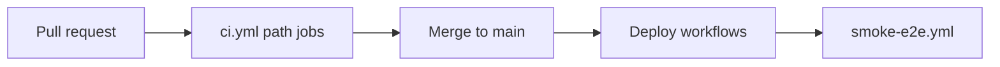

# CI/CD environments and secrets

GitHub **Environments** gate deployments and hold secrets. Configure in repo **Settings → Environments**.

> **Actual deploy mechanisms (reality as of 2026-06-01, KD-74)** — these differ from what older
> revisions of this doc described:
> - **document-parser** deploys via **Railway's native GitHub source connection** (project `au-group-be`,
>   service `au-group`, root `services/document-parser`) — it auto-deploys on every push to `main`.
>   `deploy-parser-railway.yml` is now **CI-only** (renamed *document-parser CI*) and no longer runs
>   `railway up`; **`RAILWAY_TOKEN` is not required.**
> - **Supabase migrations** are applied via **Supabase MCP `apply_migration`** directly to live. The
>   `deploy-supabase.yml` `deploy` job is **disabled (`if: false`)** — the repo migrations dir has drifted
>   from prod and `db push` would regress live (KD-74). **`SUPABASE_*` deploy secrets are not set and must
>   not be added** until KD-74 reconciles the drift.
> - See [`deploy-workflow-investigation-2026-06-01.md`](./deploy-workflow-investigation-2026-06-01.md).

## Environments

| Environment | Purpose | Protection | Workflows |
|-------------|---------|------------|------------------|
| **pr** | Pull request CI only | None | `ci.yml`, path-filtered jobs |
| **staging** | **PR integration tests (strict)** | Optional reviewers | `integration-tests.yml`, `ci.yml` integration job |
| **production** | Cron post-deploy smoke; manual-approval gate for `deploy-n8n.yml` | **Required reviewers** (manual approval) | `deploy-n8n.yml`, `smoke-e2e.yml` (cron) |

## Branch → environment

| Branch | CI | CD |
|--------|----|----|
| PR → `main` / `develop` | All path-filtered jobs | None |
| `main` push | Same | **Parser → Railway native source connection** (auto, not a GH Action); **Supabase → MCP apply (manual, not `db push`)**; n8n when paths change |
| `workflow_dispatch` | Re-run CI; n8n deploy per inputs | n8n only |

## Secrets (repository or environment)

| Secret | Used by | Description |
|--------|---------|-------------|
| ~~`RAILWAY_TOKEN`~~ | — (was `deploy-parser-railway.yml`) | **No longer used.** Parser deploys via Railway's native source connection; the GH Action is CI-only. |
| `PARSER_STAGING_URL` | Staging smoke | e.g. `https://au-group-staging.up.railway.app` |
| `PARSER_PRODUCTION_URL` | Prod smoke / cron | Matches `project.config.yaml` `api_base_url` when live |
| `DOCUMENT_PARSER_API_KEY` | Smoke, integration | Same as parser `API_KEY` in Railway |
| `N8N_BASE_URL` | n8n deploy, smoke, local export | `https://automationarchitecture.app.n8n.cloud` |
| `N8N_API_KEY` | n8n deploy, smoke, local export | n8n API key (not required for n8n CI — CI tests committed JSON only) |
| ~~`SUPABASE_ACCESS_TOKEN`~~ | — (was Supabase deploy) | **Not set / do not add (KD-74).** Migrations apply via MCP; `db push` deploy job is disabled. |
| ~~`SUPABASE_PROJECT_REF`~~ | — (was Supabase deploy) | **Not set / do not add (KD-74).** |
| ~~`SUPABASE_DB_PASSWORD`~~ | — (was Supabase deploy) | **Not set / do not add (KD-74).** |
| `SUPABASE_URL` | Integration tests | Project URL — **staging** environment |
| `SUPABASE_SERVICE_ROLE_KEY` | Integration tests | Service role (CI only) — **staging** |
| `S3_BUCKET`, `AWS_*` | Integration tests | S3 smoke fixtures |
| `EC2_HOST`, `EC2_SSH_KEY` | `deploy-parser-ec2.yml` | Phase 4 EC2 path |
| `JIRA_*` | AAA dashboard repo | Not stored here; see export package |

## Variables (non-secret)

| Variable | Example |
|----------|---------|
| `SMOKE_BANKRUPTCY_ID` | UUID for optional parse smoke |
| `SMOKE_S3_KEY` | `raw-documents/...pdf` |
| `INTEGRATION_CI_STRICT` | `false` | Set to `true` to **fail PRs** when staging integration secrets are missing (after secrets are configured) |

## Repository secrets / variables (auto-fix)

| Name | Type | Default | Description |
|------|------|---------|-------------|
| `CURSOR_API_KEY` | Secret | — | Cursor Agent (only if `AUTOFIX_CURSOR_ENABLED=true`) |
| `AUTOFIX_CURSOR_ENABLED` | Variable | `false` | Opt-in Cursor step in `pr-autofix.yml` |
| `AUTOFIX_ALLOWED_ACTORS` | Variable | — | Comma-separated logins allowed for label/manual autofix |

## Playwright (local / CI)

| Variable | Default | Purpose |
|----------|---------|---------|
| `PARSER_BASE_URL` | `http://127.0.0.1:8001` | Target for [`e2e/`](../../e2e/) tests |

CI starts the parser via [`scripts/ci/start-parser-for-e2e.sh`](../../scripts/ci/start-parser-for-e2e.sh) with `EXPOSE_OPENAPI=true`.

## AAA client dashboard (separate repo)

This repo **validates** [`export/aaa-client-dashboard/au-group/`](../../export/aaa-client-dashboard/au-group/). The dashboard app repo should:

1. Merge `patches/clients.au-group.ts.snippet` into `clients.ts`
2. Copy `data/*.json` to `app/src/app/client/data/au-group/`
3. Append [`patches/sync-jira-workflow-step.yml`](../../export/aaa-client-dashboard/au-group/patches/sync-jira-workflow-step.yml) to its Jira sync workflow

## Branch protection (configure in GitHub UI)

Recommended required checks on `main`:

- `CI / all-green` (or individual: `CI / parser`, `CI / supabase`, `CI / n8n`, `CI / export` when using required checks per job)
- 1 approving review

See [`.github/BRANCH_PROTECTION.md`](../../.github/BRANCH_PROTECTION.md) for a copy-paste checklist.

## Promotion flow

