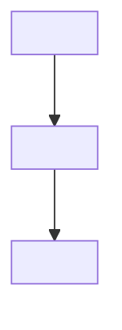
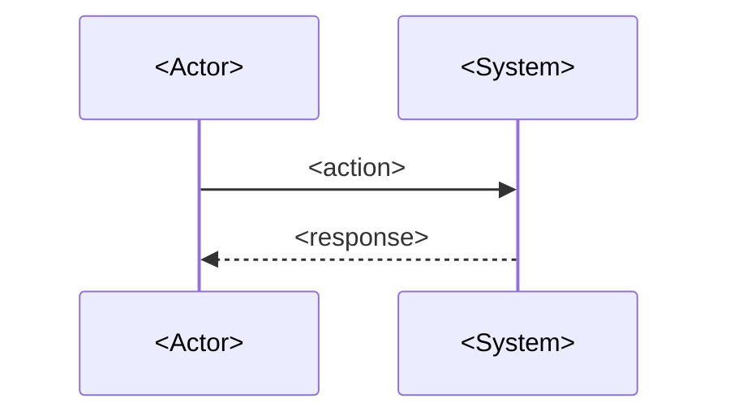

# Tech Spec — _<Project Name>_

> **Project:** _<Project codename>_
> **Client:** _<Full business name>_
> **PRD version:** _<v1.x — must match the locked PRD>_
> **Tech Spec version:** v1.0
> **Author:** `cto-technical-architect` agent
> **Date:** _<YYYY-MM-DD>_

> PRD says **what**; this document says **how**. Every architecture decision from `spec/GRILL_SESSION.md` Round 2 is locked here. No `_TBD_` in §8 (concrete tech choices) before sign-off. **No financial information** (global rule).

---

## 1. Executive Summary

_2-3 paragraphs. What's being built, the architecture in one sentence, the core trade-offs that were locked in Round 2._

## 2. Goals & Non-Goals

**Goals**
- _<bullet>_
- _<bullet>_

**Non-Goals**
- _<bullet>_
- _<bullet>_

## 3. System Context

_High-level architecture. What sits where, what talks to what._



**External dependencies**
- _<service name + version + auth method>_

## 4. Module Specifications

For each module from the PRD — interface, internal design, dependencies, error handling.

### Module: _<name>_

- **Purpose:** _<one sentence>_
- **Interface:** _<exposed functions / endpoints / events>_
- **Internal design:** _<2-4 sentences>_
- **Dependencies:** _<other modules + external services>_
- **Error handling:** _<failure modes + recovery>_

<!-- Repeat for every module the PRD names. Names must match the PRD exactly. -->

## 5. Data Model

Full DDL, indexes, foreign keys, migration strategy.

```sql
CREATE TABLE <table_name> (
  id UUID PRIMARY KEY,
  ...
);
```

**Migration strategy:** _<Alembic / Prisma / hand-rolled — match Round 2 decision>_

## 6. API Contracts

For every endpoint: method, path, request schema, response schema, errors.

### `<METHOD> /api/<path>`

- **Purpose:** _<...>_
- **Auth:** _<webhook HMAC / Clerk / admin API key / etc.>_
- **Request:**
  ```json
  { ... }
  ```
- **Response (200):**
  ```json
  { ... }
  ```
- **Errors:** _<status codes + when they fire>_

**Webhook payloads** _(if applicable)_: _<inbound webhook shape, signing, idempotency keys>_

## 7. Key Flows

End-to-end sequence diagrams for the main flows.

### Flow: _<name>_



## 8. Concrete Tech Choices

Final picks locked in `spec/GRILL_SESSION.md` Round 2. **Versions, not "latest."** No `_TBD_` here at sign-off.

| Layer | Choice | Version | Source (Round 2 Q#) |
|---|---|---|---|
| Backend language | _<e.g. Python>_ | _<3.12>_ | Q? |
| Web framework | _<e.g. FastAPI>_ | _<0.115>_ | Q? |
| LLM | _<e.g. claude-sonnet-4-6>_ | — | Q? |
| Embeddings | _<...>_ | _<...>_ | Q? |
| Vector DB | _<...>_ | _<...>_ | Q? |
| Relational DB | _<...>_ | _<...>_ | Q? |
| Deploy target | _<...>_ | _<...>_ | Q? |
| Eval platform | _<...>_ | _<...>_ | Q? |
| Observability | _<...>_ | _<...>_ | Q? |
| Queue | _<...>_ | _<...>_ | Q? |
| Secret management | _<...>_ | _<...>_ | Q? |

## 9. Deployment & Environments

- **Environments:** _<dev / staging / prod — name each and its purpose>_
- **Infra-as-code:** _<Terraform / Pulumi / docker-compose / manual + rationale>_
- **Secret management:** _<env vars / Doppler / 1Password Connect — match Round 2>_
- **CI/CD:** _<pipeline overview, who triggers what, where logs land>_

## 10. Testing Strategy

- **Unit:** _<scope, framework, coverage target>_
- **Integration:** _<scope, what's mocked vs real DB / API>_
- **Eval:** _<for AI/LLM modules — Braintrust / LangSmith / homegrown harness>_
- **CI gates:** _<which test layers block merge>_

## 11. Observability

- **Events emitted:** _<list — name + payload shape>_
- **Metrics tracked:** _<list — what they answer>_
- **Alert thresholds:** _<when someone gets paged>_
- **Tooling:** _<PostHog LLM analytics / Datadog / Sentry / structured logs — match Round 2>_

## 12. Security

- **Authentication:** _<webhook auth / admin API / internal service-to-service>_
- **Authorization:** _<RBAC / scopes / row-level>_
- **PII / data classification:** _<what's PII, where it lives, retention>_
- **Compliance posture:** _<HIPAA + BAA / SOC2 / none — match Round 2>_

## 13. Open Decisions

The handful of things still TBD. Should be small at this point — anything load-bearing belongs locked in §8 or `GRILL_SESSION.md`.

- _<question>_ — Owner: _<who>_ — Blocker: _<yes/no>_ — Resolution by: _<date / milestone>_

---

## Optional sections (include only when applicable)

> Drop the heading entirely if the section doesn't apply. Don't keep empty sections.

### A. Frontend Specification

_Only if substantial frontend work warrants its own section beyond §4 module specs. Components, state management, routing, bundling, design tokens._

### B. UX / Design Specification

_Only if UX is a major scope area. Wireframes, accessibility targets (WCAG level), design tokens not already in §A._

### C. Work Packages & Sequencing

_If sequencing the build is non-obvious. Each package = a coherent slice with dependencies + effort estimate. Maps to Jira epics in step 12._

### D. Risks & Mitigations

_Top 5-10 risks. For each: probability (L/M/H), impact (L/M/H), mitigation, owner._

### E. Source Material & References

_Links to: PRD (`spec/prd.md`), GRILL_SESSION (`spec/GRILL_SESSION.md`), proposal, sales transcripts, vendor docs, relevant standards._

### F. Appendix — Source Document Conflicts & Drift

_If the tech-spec process surfaced contradictions between the brief, PRD, proposal, or transcripts, document them here so future-you knows why this doc says X. Bumps the corresponding upstream doc to v1.x+1._

---

## Sign-off

- [ ] Module names + data flow match the PRD exactly
- [ ] §8 Concrete Tech Choices: every row has a concrete version, no `_TBD_`
- [ ] Every Round 2 decision in `GRILL_SESSION.md` is reflected somewhere in this doc
- [ ] No financial info anywhere (no pricing, deposits, payment status, contract terms)
- [ ] Assigned engineer has read end-to-end and signed off
- [ ] DOCX generated to `Client Docs/<Client>/prd/<slug>/<Client>-<Project>-Tech-Spec-v1.0.docx` (happens in step 14, not here)

When all six are checked, Discovery moves to step 12 (board population via `board-nanny`).
