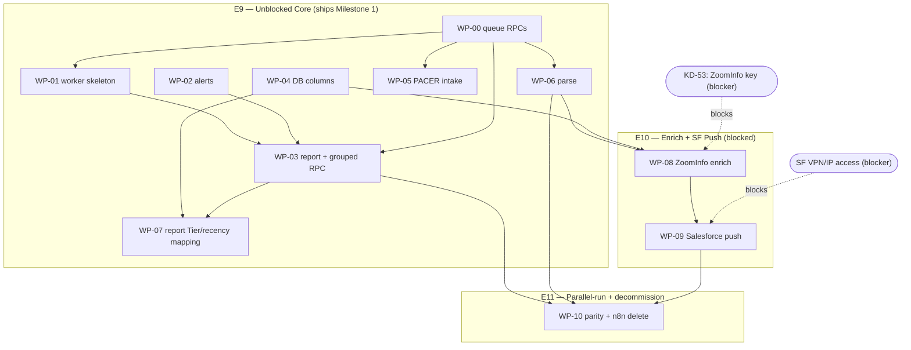

# AU Group — Epic Draft for Review

**Prepared:** 2026-05-30
**Source tech spec:** `docs/architecture/n8n-to-code-native-migration.md` (PR #36, merged/approved)
**Supporting:** `docs/project/prd.md` (PRD v3.0, MVP banner governs) · `docs/project/salesforce-audit.md`
**Target Jira project:** KD (AU Group) — team-managed Scrum, board 451
**Status:** Draft — awaiting operator approval. **Nothing has been created in Jira.**

---

## Summary

- **3 new epics proposed** to hold the WP-00…WP-10 re-platforming work: **E9** (unblocked core), **E10** (blocked enrich + SF push), **E11** (parallel-run + n8n decommission). Split at the **blocker seam** so the shippable Milestone-1 work lives in an epic/sprint that can actually close.
- **This is re-platforming, not new scope.** The WPs move the MVP pipeline off n8n onto code-native Python (FastAPI on Railway + Postgres job queue). They reuse the existing `document-parser` service, the Supabase schema, and the functional acceptance already captured in E1–E4/E8. **No new product scope is introduced.**
- **Reconciliation, not duplication.** The existing E1–E8 are the **n8n-era functional** epics (many tasks marked DEV DONE). The migration epics are the **orchestration-substrate** layer. §"Reconciliation" below maps each WP to the existing task(s) it re-platforms and **flags — does not decide — how to dispose of the old cards.**
- **Two open blockers** carried from the spec: **KD-53** (ZoomInfo prod key + SF creds — *exists, In Progress, owned by Brad*) and the **Salesforce IP/VPN lockout**. Both gate E10 only; E9 ships independently.
- **Two structural decisions need an operator call** before Phase-2 task drafting — see §"Open questions". The most important is single-E9 vs. the 3-epic split.

---

## Proposed Epics

### Epic 1: E9 — Code-Native Pipeline: Unblocked Core (off n8n)

- **Goal:** Stand up the code-native intake → parse → daily-report pipeline (queue RPCs, worker, alerts, migrations, PACER intake, parse, interim Slack report) so the Daily Creditor Report is delivered from code, not n8n — delivering Milestone 1 with no access blockers.
- **Value:** Keith gets the daily creditor report from a version-controlled, observable pipeline; the team escapes the shared-n8n execution-quota failures (SYS-05/SYS-10) for this client. This is the shippable unit the operator can demo and the engineer (Brad) can build start-to-finish today.
- **Owner:** `brad-wilcox` (Jira account `712020:d3665a47-dec9-4fc2-9e09-f41e4698c194`). **No `team.yaml` exists in the repo** — sourced from KD-53 assignee + the brief's ownership note (Yanji was let go; Brad now owns the build). See Open Question Q3.
- **Scope includes:**
  - WP-00 — `au_group_enqueue_job` + `au_group_claim_job` RPCs (pending-state producer/consumer queue; gates everything)
  - WP-01 — `pipeline/` skeleton + `worker.py` drain loop + `pipeline-worker` Railway cron service
  - WP-02 — `pipeline/alerts.py` Slack error utility (SYS-99 replacement)
  - WP-03 — interim daily report + `au_group_daily_creditor_report_grouped` RPC + `daily-report` Railway cron service
  - WP-04 — Supabase migrations: `creditors.company_tier` + `salesforce_accounts.sf_recency_status` columns
  - WP-05 — `pipeline/intake.py` PACER polling + S3 + enqueue + `intake-cron` service
  - WP-06 — `pipeline/parse.py` queue-drain → document-parser endpoint → enqueue enrich
  - WP-07 — report RPC + `report.py` Tier column + recency mapping (renders `—` / pipeline-status until E10 lands)
- **Scope excludes (explicit):**
  - ZoomInfo enrichment and Salesforce push (→ E10) — the report's Tier shows `—` and Status shows pipeline-progress until then
  - n8n deactivation/deletion (→ E11) — n8n keeps running in parallel during this epic
  - Any new product capability beyond the n8n-era MVP (Schedule F, contacts, historical DB stay deferred per PRD MVP banner)
- **Source work packages:** WP-00, WP-01, WP-02, WP-03, WP-04, WP-05, WP-06, WP-07
- **Approximate task count:** ~10–12 (WP-05 and WP-03 likely split; WP-00 and WP-04 likely 1 each)
- **Suggested sequencing:** First. WP-00 gates WP-01/05/06; WP-02 + WP-04 run in parallel from day 1; WP-03 after WP-00/01/02; WP-07 after WP-03/04.

### Epic 2: E10 — Enrichment & Salesforce Push (blocked on access)

- **Goal:** Implement the code-native ZoomInfo company enrichment + tier classification and the Salesforce account/bankruptcy-event push + recency flag, completing the full FR-5.7 report (all 7 columns).
- **Value:** Completes Milestones 2 and 3 — the Tier column and the real "New / Existing activity in Salesforce" status, plus leads landing in Salesforce. Held in its own epic so its indefinite blockers don't stall E9's closeable sprint.
- **Owner:** `brad-wilcox` (same as E9; see Q3).
- **Scope includes:**
  - WP-08 — `pipeline/enrich.py` ZoomInfo company match + tier classification + persist `company_tier`/`zoominfo_company_id`/`normalized_name`
  - WP-09 — `pipeline/salesforce.py` account match/create/update + `Bankruptcy_Event__c` + email merge vars + `sf_recency_status` compute & persist
- **Scope excludes (explicit):**
  - The two Postgres columns (WP-04) — already built in E9
  - The Salesforce **custom-field** creation (`Company_Tier__c`, `ZoomInfo_URL__c`) and live-org audit — that is the existing E1/audit work, **separate** from the WP-08/09 code and blocked on the same SF access (see Reconciliation note 4)
  - Open decisions OD-3/4/5/6 (ZoomInfo rate limits; email merge field list; recency-rule stages/objects; SF external-ID) must be resolved with Keith before/within these tasks
- **Source work packages:** WP-08, WP-09
- **Approximate task count:** ~2–4
- **Suggested sequencing:** Blocked. WP-08 starts when **KD-53** (ZoomInfo prod key) clears; WP-09 starts when **SF access** is restored *and* WP-08 is done. Phase-2 tasks here will carry explicit "is blocked by KD-53" links.

### Epic 3: E11 — Parallel-Run Validation & n8n Decommission

- **Goal:** Run code-native + n8n in parallel, confirm output parity, then deactivate and delete the 26 AU Group n8n workflows and update repo docs.
- **Value:** Retires the n8n Cloud dependency for AU Group entirely (the original driver of the migration) — only safe to do after parity is proven, so it is isolated as the final epic.
- **Owner:** `brad-wilcox` (+ operator sign-off gate; see Q3).
- **Scope includes:**
  - WP-10 — 5-business-day parallel-run parity check (intake/parse/report, then full); archive + delete n8n workflows; update README.md + CLAUDE.md
- **Scope excludes (explicit):**
  - Building any pipeline stage (those are E9/E10)
- **Source work packages:** WP-10
- **Approximate task count:** ~2–3 (likely split: intake/parse/report parity vs. full-stack parity + decommission, since they unblock at different times)
- **Suggested sequencing:** Last, and **straddles** — the intake/parse/report parity slice can begin once E9's WP-03 + WP-06 are running; the **full** decommission waits on E10's WP-09. Phase-2 will not force this into one clean dependency; it splits across the two readiness points.

---

## Reconciliation vs. existing E1–E8

The migration **re-platforms the orchestration** of the n8n-era MVP functions; it does not re-spec them. Map of each WP to the existing card(s) whose *function* it re-implements code-native:

| Migration WP | Re-platforms (existing KD task) | Existing status | n8n stage |
|---|---|---|---|
| WP-05 intake | KD-15 (PACER poll), KD-16 (Form 201), KD-17 (Form 204), KD-18 (classify) | DEV DONE | SYS-01/01B |
| WP-06 parse | document-parser `/parse` (KD-2 family) | — | SYS-02 |
| WP-03 report | KD-19 (daily filing summary), KD-48 (daily processing summary) | DEV DONE | SYS-09 |
| WP-02 alerts | KD-45 (error/retry framework) | DEV DONE | SYS-99 |
| WP-08 enrich | KD-20 (ZoomInfo lookup), KD-21 (tier), KD-24 (normalization) | DEV DONE / In Progress | SYS-03 |
| WP-09 SF push | KD-25 (match/create), KD-26 (bankruptcy event), KD-29 (recency/email rec) | In Progress / To Do | SYS-04 |
| WP-00 queue RPCs | (new — no n8n equivalent; replaces `au_group_acquire_processing_job` usage) | — | n/a |
| WP-04 DB columns | (new Postgres columns; distinct from SF custom fields) | — | n/a |

**Reconciliation notes (FLAGGED for operator — board-nanny will not decide these silently):**

1. **The DEV-DONE cards are not duplicates to re-create.** Their functional acceptance ("Top 20 extracted", "tier classified") still holds; the migration changes *how it runs* (Python/Railway/queue), not *what it produces*. In Phase 2, board-nanny will **not** re-spawn their acceptance criteria as new tasks. **Decision needed (Q1):** how to dispose of the old cards — (a) `Relates` link from each WP task and keep the DEV-DONE cards as the functional record, or (b) reopen/supersede them. Default recommendation: **(a)** — keep them, relate-link, do not auto-close.

2. **E1–E4 and E8 stay as the functional epics.** E9–E11 are an additive orchestration layer that references them. No existing epic is renamed, re-scoped, or closed by this draft.

3. **E5–E7 are untouched.** They are already MVP-deferred (ISSUES/BLOCKED) and the migration explicitly leaves SYS-06/07/08 as Phase-2 stubs. No relationship to E9–E11.

4. **WP-04 (Postgres columns) ≠ Salesforce custom fields.** WP-04 adds `creditors.company_tier` + `salesforce_accounts.sf_recency_status` in Supabase (unblocked, in E9). The Salesforce-side `Company_Tier__c` / `ZoomInfo_URL__c` custom fields + live-org audit are the **existing E1/KD-10 + salesforce-audit.md** work, blocked on SF access, and belong to the SF-push readiness, **not** to WP-04. Phase 2 keeps these distinct.

5. **KD-53 is the live blocker handle.** It exists, is In Progress, and is owned by Brad. Phase-2 WP-08/09 tasks will carry explicit **"is blocked by KD-53"** links rather than re-stating the blocker in prose.

---

## Sequencing diagram

---

## Open questions for operator

**Q1 — (BLOCKING Phase 2) Single epic vs. 3-epic split.** This draft recommends **3 epics** (E9 core / E10 blocked / E11 decommission) rather than one E9 holding all of WP-00…10. Rationale: our Phase-2 rule is one 7-day Sprint per Epic, scope = all tasks under it. A single E9 would force the indefinitely-blocked WP-08/09 into the same sprint as the shippable core, and that sprint could never close. **Do you want one migration epic with blocked tasks inside, or the unblocked-core epic that can actually close?** If you prefer a single E9, say so and I'll collapse the structure.

**Q2 — Disposition of the DEV-DONE n8n-era cards.** (See Reconciliation note 1.) Recommend **relate-link and keep** (option a) so the functional record survives and Phase 2 doesn't re-create that acceptance. Confirm, or tell me to reopen/supersede them instead.

**Q3 — Owner / `team.yaml`.** There is **no `team.yaml`** in the repo and no owner block in `project.config.yaml`. I've set Owner = `brad-wilcox` (Jira account `712020:d3665a47-dec9-4fc2-9e09-f41e4698c194`) for all three epics, sourced from the KD-53 assignee and the "Brad now owns the build" note. This Owner becomes the Phase-2 Sprint assignee and every Task's assignee. Confirm the login string you want recorded (e.g. is `brad-wilcox` your canonical `team.yaml`-style login, or should it be your email / a different handle?). **Separately:** the existing E1–E8 cards are all still assigned to **Yanji** — a reassignment sweep is noted as out of scope for this draft per the brief.

**Q4 — Epic naming/numbering.** I've proposed continuing the `E9/E10/E11` series to match the existing `E1`–`E8` convention. Confirm that numbering, or tell me a preferred label.

---

## Approval

To proceed to Task drafting, reply with **"Epics approved"** (and your answers to Q1–Q4), or list specific revisions needed. I will not create anything in Jira until the Task draft is also approved in Phase 2.
