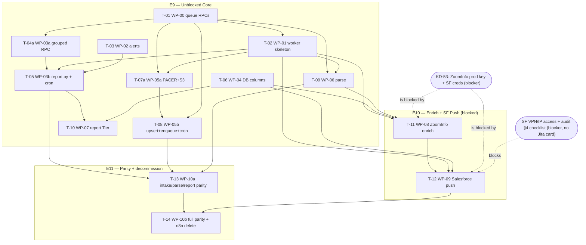

# AU Group — Task Draft for Review

**Prepared:** 2026-05-30
**Source tech spec:** `docs/architecture/n8n-to-code-native-migration.md` (WP-00…WP-10 authoritative)
**Source Epic draft:** `tickets/au-group-epics-2026-05-30.md` (approved 2026-05-30; 3-epic split E9/E10/E11; relate-link-and-keep DEV-DONE cards; owner = Brad Wilcox)
**Target Jira project:** KD (AU Group) — team-managed Scrum, board 451
**Owner / assignee (all epics + tasks):** Brad Wilcox — Jira accountId `712020:d3665a47-dec9-4fc2-9e09-f41e4698c194`
**Status:** Draft — awaiting operator approval. **Nothing has been created in Jira.**

---

## Summary

- **Total tasks:** 14 (E9: 10 · E10: 2 · E11: 2)
- **By Epic:** E9 — Unblocked Core: 10 · E10 — Enrich & SF Push: 2 · E11 — Parallel-Run & Decommission: 2
- **By discipline:** BE: 14 (all work is backend/DevOps Python + Supabase + Railway per spec §9 "All WPs assigned to BE"). No FE/UX in this migration.
- **Critical path length:** 6 tasks — `T-01 (WP-00) → T-02 (WP-01) → T-09 (WP-06 parse) → T-11 (WP-08 enrich) → T-12 (WP-09 SF push) → T-14 (WP-10b full parity + decommission)`. This is the full-MVP path and runs through both access blockers. The **unblocked Milestone-1 path** to report delivery is 3 tasks: `T-01 (WP-00) → T-04a (WP-03a grouped RPC) → T-05 (WP-03b report delivered)` (with `T-01 → T-02 → T-05` running in parallel).
- **Splits applied:** WP-03 → 2 tasks (grouped RPC migration / report.py + cron). WP-05 (L) → 2 tasks (PACER auth + discovery + S3 / upsert + enqueue + intake-cron). WP-10 → 2 tasks (intake-parse-report parity / full-stack parity + decommission), matching the epic-draft split. WP-08 and WP-09 kept atomic (justification inline). All other WPs → 1 task each.
- **Three spec inconsistencies surfaced in §"Flagged issues"** (WP-05 dep conflict; Tier-in-RPC contradiction WP-03 vs WP-07; WP-09 blocker set vs operator shorthand). **Board-nanny has NOT resolved these — operator call needed.**

---

## Task ID → WP map

| Task | WP | Epic | Effort | Split note |
|---|---|---|---|---|
| T-01 | WP-00 | E9 | S | atomic (two RPCs, one migration) |
| T-02 | WP-01 | E9 | M | — |
| T-03 | WP-02 | E9 | S | — |
| T-04a | WP-03 (a) | E9 | S | grouped-RPC migration half |
| T-05 | WP-03 (b) | E9 | M | report.py + daily-report cron half |
| T-06 | WP-04 | E9 | S | atomic (two columns, two migrations, same convention) |
| T-07a | WP-05 (a) | E9 | M | PACER auth + discovery + S3 download half |
| T-08 | WP-05 (b) | E9 | M | bankruptcies upsert + enqueue + intake-cron half |
| T-09 | WP-06 | E9 | M | — |
| T-10 | WP-07 | E9 | S | — |
| T-11 | WP-08 | E10 | L | atomic — blocked, cohesive (see inline justification) |
| T-12 | WP-09 | E10 | L | atomic — blocked, cohesive (see inline justification) |
| T-13 | WP-10 (a) | E11 | S–M | intake/parse/report parity slice |
| T-14 | WP-10 (b) | E11 | M | full-stack parity + n8n decommission |

---

## Tasks by Epic

### Epic E9 — Code-Native Pipeline: Unblocked Core

#### T-01: Add `au_group_enqueue_job` + `au_group_claim_job` Supabase RPCs (producer/consumer queue)
- **Discipline:** [BE]
- **Effort:** S
- **Blocked by:** none
- **Blocks:** T-02 (WP-01), T-07a/T-08 (WP-05), T-09 (WP-06)
- **Relates to:** none (new — no n8n equivalent; replaces `au_group_acquire_processing_job` usage in new modules)

**User story:**
> As an engineer, I want a `pending`-state enqueue RPC and an atomic claim RPC so that intake can produce jobs and the worker can consume them later without the n8n acquire-and-execute-in-one-step model, and so the rest of the pipeline can be built on a real producer/consumer queue.

**Description:**
The existing `au_group_acquire_processing_job` RPC creates a job in `running` state in one step — correct for n8n, wrong for the code-native producer/consumer split where intake enqueues and the worker claims later. Add two additive Supabase RPCs in one migration (`20260530XXXXXX_au_group_enqueue_and_claim_job_rpcs.sql`), per spec §4.2 and WP-00:

1. `au_group_enqueue_job(p_bankruptcy_id, p_job_type)` — inserts a `pending` row; no-ops (`enqueued=false`) if a `pending` OR `running` job already exists for that `(bankruptcy_id, job_type)`. Adds a **new** partial unique index `... ON processing_jobs (bankruptcy_id, job_type) WHERE status='pending'` (existing singleton indexes only cover `running`); the insert catches both the pending-dupe and running-singleton `unique_violation`, returning `enqueued=false`.
2. `au_group_claim_job(p_job_type)` — atomic claim: `UPDATE … SET status='running', started_at=now() WHERE id = (SELECT id FROM processing_jobs WHERE status='pending' AND job_type=$1 ORDER BY created_at LIMIT 1 FOR UPDATE SKIP LOCKED) RETURNING *`. Catches `unique_violation` from the singleton index (a parallel worker or n8n claimed the same bankruptcy) and retries the next row; returns the claimed row or NULL.

The existing `au_group_acquire_processing_job` is **not modified** — n8n keeps using it during parallel run. This task gates all queue-using work (WP-01/05/06).

**Acceptance criteria:** (verbatim from spec WP-00)
- [ ] `au_group_enqueue_job(id, 'document_parse')` inserts `status='pending'` row on first call
- [ ] Second call with same args returns `{enqueued: false}` (idempotent)
- [ ] `au_group_enqueue_job` is a no-op when a `running` job already exists (n8n running)
- [ ] New partial unique index on `(bankruptcy_id, job_type) WHERE status='pending'` created (existing singleton indexes only cover `running`)
- [ ] `au_group_claim_job('document_parse')` flips one `pending` row to `running`; returns the row
- [ ] `au_group_claim_job` returns NULL when no pending jobs exist
- [ ] Two concurrent `au_group_claim_job` calls on the same job: exactly one succeeds; the other skips (race-safe via SKIP LOCKED + unique_violation catch)
- [ ] Existing `au_group_acquire_processing_job` RPC is untouched (n8n compatibility)
- [ ] Migration applies cleanly via `supabase db push`

**Technical notes:** Migration naming `20260530XXXXXX_au_group_enqueue_and_claim_job_rpcs.sql` (timestamp-prefixed, `au_group_*` identifier per repo CLAUDE.md). Reference the existing singleton partial indexes from migration `20260215180000`.

---

#### T-02: Pipeline skeleton + `worker.py` drain loop + `pipeline-worker` Railway cron service
- **Discipline:** [BE]
- **Effort:** M
- **Blocked by:** T-01 (WP-00)
- **Blocks:** T-05 (WP-03b report.py — shares `settings.py`), T-07a (WP-05a — shares skeleton/settings), T-09 (WP-06 parse)
- **Relates to:** none

**User story:**
> As an engineer, I want a `pipeline/` package and a queue-draining `worker.py` cron entry-point so that per-bankruptcy stage work runs on Railway cron, survives redeploys, and exits cleanly — replacing n8n's execution model with a version-controlled drain loop.

**Description:**
Create `services/document-parser/pipeline/` with `__init__.py`, `settings.py` (Pydantic `PipelineSettings` per spec §7.2), and `worker.py`. `worker.py` is the Railway cron entry-point: (a) call `au_group_fail_stale_processing_jobs` first, (b) loop — claim one `pending` `document_parse` job at a time via `au_group_claim_job` (atomic `pending`→`running`), (c) dispatch to the stage module, repeat until claim returns NULL, (d) exit 0. Add the `pipeline-worker` Railway service (`*/30 * * * *`, `rootDirectory = services/document-parser`, `startCommand = "python -m pipeline.worker"` — **no `$PORT`**; cron services bind no port). Per repo CLAUDE.md, both `rootDirectory` AND a GitHub source connection must be set or `railway.toml` is silently ignored.

**Acceptance criteria:** (verbatim from spec WP-01)
- [ ] `python -m pipeline.worker` runs locally without error (with a mock Supabase client)
- [ ] `worker.py` calls `au_group_fail_stale_processing_jobs` before claiming jobs
- [ ] `au_group_claim_job` RPC called; NULL return (nothing pending) causes worker to exit 0 cleanly
- [ ] Railway cron service (`*/30 * * * *`) configured; `startCommand = "python -m pipeline.worker"` (no port binding; cron services do not use `$PORT`)
- [ ] `SKIP_ENRICH=true` and `SKIP_SF=true` env-var guards wired (no-op when set)
- [ ] Worker exits within 25 minutes (well under the 30-minute cron interval to avoid Railway skip)

**Technical notes:** `pipeline/settings.py` extends the existing `app/core/config.py get_settings()` with the env vars in spec §7.2 (`pacer_username`, `zoominfo_api_key`, `skip_enrich`, `skip_sf`, etc.).

---

#### T-03: Slack error-alerting utility (`pipeline/alerts.py`) — SYS-99 replacement
- **Discipline:** [BE]
- **Effort:** S
- **Blocked by:** none
- **Blocks:** T-05 (WP-03b report.py imports `alerts`)
- **Relates to:** **KD-45** (error/retry framework, DEV DONE) — relate-link only; do NOT reopen or re-spawn its AC

**User story:**
> As an internal operator, I want pipeline failures posted to Slack with stage and bankruptcy context so that I can see and triage errors without digging through Railway logs — replacing the n8n SYS-99 Error Logger.

**Description:**
Create `pipeline/alerts.py` with `send_error_alert(stage, error, bankruptcy_id=None, metadata=None)` that POSTs a formatted error block to `SLACK_WEBHOOK_URL`. Called from the `except` blocks of every other pipeline module. Replaces SYS-99. This is the orchestration-substrate re-platforming of the function KD-45 already delivered in n8n — relate-link to KD-45, do not duplicate its acceptance.

**Acceptance criteria:** (verbatim from spec WP-02)
- [ ] `send_error_alert("intake", "PACER timeout", "uuid-123")` posts a formatted Slack block
- [ ] Gracefully handles `SLACK_WEBHOOK_URL` missing (logs only, does not raise)
- [ ] Unit test: mock `httpx.post`; confirm payload shape
- [ ] No secrets logged

**Technical notes:** Uses `httpx` (already at 0.28.1). No new dependency.

---

#### T-04a: Grouped daily-report RPC migration (`au_group_daily_creditor_report_grouped`)
- **Discipline:** [BE]
- **Effort:** S
- **Blocked by:** T-01 (WP-00) — this migration updates `au_group_creditor_pipeline_status` to count the new queue's **`pending`** rows, and the `pending` state is introduced by WP-00. (Spec WP-03 Dependencies names WP-00; the Phase-2 brief restates "WP-03 report depends on WP-00.") It does NOT need WP-01/02 — those attach to T-05.
- **Blocks:** T-05 (WP-03b report.py calls this RPC)
- **Relates to:** none (additive RPC; the SYS-09 functional record is KD-19/KD-48, related on T-05)

**User story:**
> As an engineer, I want a debtor-grouped report RPC that returns one row per (creditor × bankruptcy) so that the daily report can group by bankrupt company without collapsing a creditor that appears in two debtors — fixing the lateral-join gap in the existing flat RPC.

**Description:**
The existing `au_group_daily_creditor_report_rows` (migration `20260529180000`) returns flat per-creditor rows whose lateral join keeps only the *latest* bankruptcy's state per creditor, collapsing multi-debtor creditors. The PRD requires grouping by debtor. Create an **additive** function `au_group_daily_creditor_report_grouped(p_since timestamptz default null)` returning JSONB `{since, debtor_count, creditor_count, rows: [{debtor_name, case_number, filing_date, creditor, city, state, claim, status, zoominfo_url}, …]}` — one row per (creditor × bankruptcy). The existing `_rows` function is **not modified** (backward-compatible). Per spec §4.2, the `status` field calls `au_group_creditor_pipeline_status`, which **must be updated to also count the new queue's `pending` rows** (currently only `queued`/`running`/`retrying`), or pending enrichments mis-render as "New" instead of "Pending Enrichment".

> **NOTE — see Flagged Issue #2:** spec §4.2 says this grouped function "should include `creditors.company_tier`," but WP-07 adds tier to the *different* `_rows` function. Whether `company_tier` (and therefore a dependency on T-06/WP-04) belongs in THIS migration is an open operator decision. AC below is written **without** the tier column pending that call; if the operator routes tier into the grouped RPC, this task gains a "blocked by T-06" edge and a tier-column AC.

**Acceptance criteria:** (from spec WP-03 (a) + §4.2)
- [ ] Migration applies cleanly via `supabase db push`
- [ ] `au_group_daily_creditor_report_grouped()` returns JSONB with per-(creditor × debtor) rows including `debtor_name`, `case_number`, `filing_date`
- [ ] A creditor linked to two bankruptcies yields two rows with different `debtor_name`
- [ ] `au_group_creditor_pipeline_status` updated to count the new queue's `pending` rows (so pending enrichment renders "Pending Enrichment", not "New")
- [ ] Existing `au_group_daily_creditor_report_rows` is unchanged (backward-compatible)

**Technical notes:** Migration naming `20260530XXXXXX_au_group_daily_creditor_report_grouped.sql`.

---

#### T-05: `pipeline/report.py` interim daily report + `daily-report` Railway cron service
- **Discipline:** [BE]
- **Effort:** M
- **Blocked by:** T-04a (WP-03a — calls the grouped RPC), T-02 (WP-01 — `settings.py`), T-03 (WP-02 — `alerts.py`)
- **Blocks:** T-10 (WP-07 — report.py Tier/recency mapping extends this), T-13 (WP-10a — report parity needs the report running)
- **Relates to:** **KD-19** (daily filing summary, DEV DONE), **KD-48** (daily processing summary, DEV DONE) — relate-link only; do NOT reopen or re-spawn their AC

**User story:**
> As an internal operator (delivering to Keith), I want the daily creditor report posted to `#au-group-sprint` grouped by bankrupt company so that Keith receives the same daily signal he got from n8n SYS-09, now from a version-controlled pipeline — even while ZoomInfo/SF are blocked.

**Description:**
Create `pipeline/report.py`: call `au_group_daily_creditor_report_grouped()`, group rows by `debtor_name` in Python, sort debtors by `filing_date DESC` and creditors within each debtor by numeric claim DESC, format the Slack message (spec §4.3), and POST to `SLACK_WEBHOOK_URL`. Exit 0 on success, exit 1 on failure (with `alerts.py` firing). Add the `daily-report` Railway cron service (`0 13 * * 1-5` = 8 AM ET standard — see OD-1). Interim contract: Tier renders `—` (NULL `company_tier`); Status renders the pipeline-progress string until `sf_recency_status` is populated. Slack 4,000-char/block limit: split reports > ~40 creditors into one message per debtor group plus a summary header.

**Acceptance criteria:** (verbatim from spec WP-03 (b))
- [ ] `python -m pipeline.report` posts a correctly-formatted Slack message to `#au-group-sprint`
- [ ] Report grouped by debtor; debtors sorted by `filing_date DESC`; creditors within debtor sorted by claim amount DESC (numeric, not string)
- [ ] A creditor linked to two bankruptcies appears in both debtor groups in the Slack output
- [ ] Reports with > 40 creditors across all debtors split into multiple Slack messages (one per debtor group + a header)
- [ ] Tier column shows `—` when `company_tier IS NULL`
- [ ] Status column shows pipeline-progress string when `sf_recency_status IS NULL`; recency string when populated
- [ ] On Supabase RPC error: `alerts.py` fires; process exits 1
- [ ] Railway cron service fires at 13:00 UTC Mon–Fri; cron service has no port binding in startCommand; confirmed via Railway deploy log

**Technical notes:** Report-timing DST handling is **OD-1** (fixed 13:00 UTC vs DST-switched) — operator + Keith call before deploy. Does NOT block writing the module.

---

#### T-06: Supabase migrations — `creditors.company_tier` + `salesforce_accounts.sf_recency_status`
- **Discipline:** [BE]
- **Effort:** S
- **Blocked by:** none
- **Blocks:** T-10 (WP-07 — Tier column reads `company_tier`), T-11 (WP-08 — enrich persists `company_tier`)
- **Relates to:** none (new Postgres columns; **distinct** from the Salesforce `Company_Tier__c`/`ZoomInfo_URL__c` custom fields — those are E1/salesforce-audit work, per Reconciliation note 4)

**User story:**
> As an engineer, I want the `company_tier` and `sf_recency_status` columns in Postgres so that the enrich and SF-push stages have a place to persist tier and recency, and the daily report can read the FR-5.5 status without a live Salesforce call at report time.

**Description:**
Two additive Supabase migrations (spec §5.2), naming `20260530XXXXXX_au_group_*.sql`:
1. `ALTER TABLE creditors ADD COLUMN IF NOT EXISTS company_tier VARCHAR(20) CHECK (company_tier IN ('Enterprise','Mid-Market','SMB'))` — nullable (NULL = not yet enriched).
2. `ALTER TABLE salesforce_accounts ADD COLUMN IF NOT EXISTS sf_recency_status VARCHAR(60)` — nullable (NULL = not yet pushed).

Per Reconciliation note 4, these are **Postgres** columns, separate from the Salesforce custom fields. Regenerate TypeScript types after.

**Acceptance criteria:** (verbatim from spec WP-04)
- [ ] Both migrations apply cleanly via `supabase db push`
- [ ] `company_tier` is nullable (NULL = not yet enriched); constraint enforced
- [ ] `sf_recency_status` is nullable (NULL = not yet pushed)
- [ ] TypeScript types in `types/database.types.ts` regenerated

**Technical notes:** Tier-storage location (`creditors` vs `zoom_info_contacts`) is **OD-2** — spec recommends `creditors.company_tier` (this task). Spec uses `VARCHAR(60)` for `sf_recency_status` in §5.2 (the §5 example comment shows `VARCHAR(50)`; §5.2 SQL is authoritative at 60).

---

#### T-07a: PACER intake — session auth, filing discovery, Form 201/204 → S3
- **Discipline:** [BE]
- **Effort:** M
- **Blocked by:** T-01 (WP-00 — shares the enqueue RPC contract / queue), T-02 (WP-01 — shares `pipeline/` skeleton + `settings.py`)
- **Blocks:** T-08 (WP-05b — upsert/enqueue consumes discovered cases + S3 keys)
- **Relates to:** **KD-15** (PACER poll), **KD-16** (Form 201), **KD-17** (Form 204) — relate-link only; do NOT reopen or re-spawn their AC

**User story:**
> As an internal operator, I want the intake stage to authenticate to PACER, find new Chapter 11 filings in target states, and store the Form 201 + Form 204 PDFs in S3 so that downstream parsing has the source documents — replacing n8n SYS-01/SYS-01B's discovery+download.

**Description:**
First half of `pipeline/intake.py` (spec §4.2 Stage 0). Authenticate to PACER with `PACER_USERNAME`/`PACER_PASSWORD`; query for new Chapter 11 filings since last successful run (max `bankruptcies.created_at` or a `last_run_at` key in `au_group_runtime_config`); scope the court search to `au_group_target_states` (read from the Supabase runtime-config table). For each new case, download Form 201 (voluntary petition) + Form 204 (top-20 creditors) and store both PDFs in S3 under `raw-documents/{case_number}/form-201.pdf` and `form-204.pdf`. Provide a dry-run mode (`PACER_DRY_RUN=true`) that logs discovery without writing to DB or S3. The `bankruptcies` upsert, job enqueue, `pacer_poll` row, and the `intake-cron` service are **T-08**.

> **NOTE — see Flagged Issue #1:** WP-05's "Dependencies" field names WP-01, but spec §8.1/§10 say "After WP-00" and "can begin before WP-01 completes; shares enqueue RPC." This draft routes T-07a as blocked by **both T-01 and T-02** (it needs the queue contract AND the `pipeline/`+`settings.py` skeleton to live in). If the operator wants intake to start before WP-01 completes, drop the T-02 edge and keep only T-01.

**Acceptance criteria:** (PACER-auth + discovery + S3 subset of spec WP-05; remainder on T-08)
- [ ] PACER session auth succeeds with `PACER_USERNAME`/`PACER_PASSWORD`
- [ ] Court search scoped to `au_group_target_states` (read from Supabase runtime config table)
- [ ] Form 201 + Form 204 PDFs stored in S3 `raw-documents/{case_number}/form-201.pdf` and `form-204.pdf`
- [ ] Dry-run mode (`PACER_DRY_RUN=true`): logs discovery without writing to DB or S3

**Technical notes:** PACER API surface (Case Locator REST vs CM/ECF scrape) is **OD-8**; intake filing-type scope (CH11-only vs +CH7/Subchapter V) is **OD-7** — both operator/Keith decisions that affect this half. Per spec risk row, stub `intake.py` with a PACER mock for unit tests; do not let OD-8 block the report tasks.

---

#### T-08: Intake — `bankruptcies` upsert + enqueue `document_parse` + `intake-cron` service
- **Discipline:** [BE]
- **Effort:** M
- **Blocked by:** T-07a (WP-05a — consumes discovered cases + S3 keys), T-01 (WP-00 — `au_group_enqueue_job`)
- **Blocks:** T-13 (WP-10a — intake parity needs the full intake path running)
- **Relates to:** **KD-18** (classify) — relate-link only; do NOT reopen or re-spawn its AC

**User story:**
> As an internal operator, I want each discovered case upserted into `bankruptcies` and a `document_parse` job enqueued idempotently, then the whole intake stage running on a daily Railway cron, so that new filings flow into the parse queue automatically without duplicates.

**Description:**
Second half of `pipeline/intake.py` (spec §4.2 Stage 0, steps 3–6). Call `au_group_upsert_bankruptcy` (existing, migration `20260515150100`) to insert/update the `bankruptcies` row (idempotent on UNIQUE `case_number`); call `au_group_enqueue_job(bankruptcy_id, 'document_parse')` (no-op if pending/running already exists); insert a `pacer_poll` `processing_job` row (`completed`/`failed`) per ADR-001; on error call `alerts.py`. Add the `intake-cron` Railway cron service (`0 9 * * 1-5` UTC, `python -m pipeline.intake`, no `$PORT`).

**Acceptance criteria:** (upsert + enqueue + cron subset of spec WP-05)
- [ ] `bankruptcies` row upserted (no duplicate on re-run for same `case_number`)
- [ ] `document_parse` job **enqueued** via `au_group_enqueue_job`; `enqueued=false` (already pending/running) handled without error
- [ ] `pacer_poll` `processing_job` row set to `completed` or `failed` per ADR-001
- [ ] `intake-cron` Railway cron service (`0 9 * * 1-5`, `python -m pipeline.intake`, no port binding) configured; confirmed via deploy log
- [ ] Integration test (with test PACER account or stub): verifies at least one case is found and enqueued

**Technical notes:** Splitting WP-05's L effort here: T-07a (discovery/download) + T-08 (persist/enqueue/cron) are each ~M and independently testable. Enqueue uses the WP-00 RPC, not the legacy `au_group_acquire_processing_job`.

---

#### T-09: `pipeline/parse.py` — queue drain → document-parser `/parse/document` → enqueue enrich
- **Discipline:** [BE]
- **Effort:** M
- **Blocked by:** T-01 (WP-00 — claim/enqueue RPCs), T-02 (WP-01 — worker skeleton/dispatch)
- **Blocks:** T-11 (WP-08 — enrich consumes the `zoom_info_enrich` jobs this stage enqueues), T-13 (WP-10a — parse parity)
- **Relates to:** **document-parser `/parse` (KD-2 family)** — relate-link to the parse-service card(s); do NOT reopen or re-spawn their AC

**User story:**
> As an engineer, I want the parse stage to claim `document_parse` jobs, call the existing document-parser async endpoint, and enqueue the next stage so that creditor extraction runs code-native off the queue — replacing n8n SYS-02 orchestration while reusing the same FastAPI parse service.

**Description:**
Create `pipeline/parse.py` (spec §4.2 Stage 1). Claim a `document_parse` job via `au_group_claim_job`; POST to `{DOCUMENT_PARSER_URL}/api/v1/parse/document` with `bankruptcy_id`, the Form 204 S3 key, and `async_mode: true` (requires both `ASYNC_PARSE_ENABLED=true` service env AND `async_mode: true` body); poll `GET /api/v1/jobs/{document_id}` until `completed`/`failed` (`X-API-Key` auth). The document-parser service writes creditor rows (idempotent merge on `(bankruptcy_id, creditor_name)` via `au_group_upsert_document_parse_result`, migration `20260523140000`) — this stage does **not** write creditors directly. On `completed`, mark the job `completed` and enqueue `zoom_info_enrich`.

**Acceptance criteria:** (verbatim from spec WP-06)
- [ ] Claims `document_parse` job via `au_group_claim_job` (consumes a `pending` row)
- [ ] Async mode: polls `GET /api/v1/jobs/{document_id}` until `completed` or `failed`
- [ ] On parser return `manual_review_required=true`: marks job `manual_review_required` (do **not** enqueue enrich job)
- [ ] On parser return `completed`: marks job `completed`; **enqueues** `zoom_info_enrich` via `au_group_enqueue_job`
- [ ] On parse failure after 3 retries: marks job `failed`; fires `alerts.py`
- [ ] `X-API-Key` header sent; 401/403 errors surface as fatal (do not retry)
- [ ] Unit test: mock `/parse/document` endpoint; verify job state transitions

**Technical notes:** Async pattern documented in the document-parser README. `async_mode: true` in the body is mandatory or the call runs synchronously with no `document_id` to poll.

---

#### T-10: Report RPC Tier column + `report.py` Tier / recency mapping (`au_group_daily_creditor_report_rows`)
- **Discipline:** [BE]
- **Effort:** S
- **Blocked by:** T-05 (WP-03b — extends `report.py`), T-06 (WP-04 — reads `company_tier`)
- **Blocks:** none
- **Relates to:** none

**User story:**
> As an internal operator, I want the daily report to render the Tier column and the real Salesforce-recency Status (when available) so that Keith sees the full FR-5.7 contract as soon as enrichment and SF push land — and `—`/pipeline-status until then.

**Description:**
Add `company_tier` to the `au_group_daily_creditor_report_rows` output (`c.company_tier::text as tier`, NULL → empty string) via migration, and update `report.py` to render Tier as `Enterprise`/`Mid-Market`/`SMB` or `—` if NULL, and to render Status as `sf_recency_status` when a `salesforce_accounts` record exists (pipeline-progress otherwise).

> **NOTE — see Flagged Issue #2:** WP-07 modifies `au_group_daily_creditor_report_rows`, but `report.py` (T-05) reads `au_group_daily_creditor_report_grouped`. As written these touch *different* RPCs. The AC below is copied verbatim from the spec; if the operator confirms tier should live in the *grouped* RPC, this task's migration AC and its dependency edges shift (the tier column moves to T-04a, blocked by T-06). Not resolved here.

**Acceptance criteria:** (verbatim from spec WP-07)
- [ ] Migration adds `tier` to RPC output: `c.company_tier::text as tier` (NULL → empty string)
- [ ] `report.py` renders Tier as `Enterprise`/`Mid-Market`/`SMB` or `—` if NULL
- [ ] `report.py` renders Status as `sf_recency_status` when `salesforce_accounts` record exists; pipeline-progress otherwise
- [ ] Existing RPC unit tests pass

**Technical notes:** Tier is NULL-everywhere until T-11 (WP-08) runs, so this task is testable now but only renders real tiers post-enrichment.

---

### Epic E10 — Enrichment & Salesforce Push (blocked on access)

#### T-11: `pipeline/enrich.py` — ZoomInfo company match + tier classification + persist
- **Discipline:** [BE]
- **Effort:** L — **kept atomic.** Justification: company-match, name-normalization, tier-classification, and persistence form one cohesive ZoomInfo round-trip per creditor; splitting would create sub-day fragments that re-merge. The whole task is blocked on KD-53, so estimates can't be refined until the key lands. Revisit the split if KD-53 clears and scope sharpens.
- **Blocked by (tasks):** T-02 (WP-01 — worker dispatch), T-06 (WP-04 — `company_tier` column), T-09 (WP-06 — consumes the `zoom_info_enrich` jobs parse enqueues)
- **Blocked by (external — BLOCKER FLAG):** **KD-53** — ZoomInfo production API key. Link as "is blocked by KD-53" at creation.
- **Blocks:** T-12 (WP-09 — SF push needs enriched firmographics + tier)
- **Relates to:** **KD-20** (ZoomInfo lookup), **KD-21** (tier), **KD-24** (normalization) — relate-link only; do NOT reopen or re-spawn their AC

**User story:**
> As an internal operator, I want each company creditor enriched with ZoomInfo firmographics, canonical-named, and tier-classified so that the report and Salesforce push carry the correct tier and normalized company identity — replacing n8n SYS-03.

**Description:**
Create `pipeline/enrich.py` (spec §4.2 Stage 2). Claim `zoom_info_enrich` jobs; for each company creditor (`is_company=true`, not junk, `zoominfo_company_id IS NULL`): POST a ZoomInfo company search (name + state); apply name normalization (FR-4.5, use canonical name if confidence ≥ threshold); classify tier (FR-4.2 — Enterprise ≥ $1B revenue OR ≥ 5,000 employees; Mid-Market $100M–$1B or 500–5,000; SMB below; inclusive $100M boundary → Mid-Market); persist `zoominfo_company_id` (via `au_group_set_creditor_zoominfo_company_id`, migration `20260529160000`), `company_tier`, and `normalized_name` (migration `20260529160500`); write a company-level `zoom_info_contacts` row (contact fields NULL in MVP). Guard at entry: `if not settings.zoominfo_api_key: sys.exit(0)`. Rate-limit: batch in groups of 10 with `tenacity` exponential backoff on HTTP 429 (3 attempts, 15 s base). On `zoom_info_enrich` completion, enqueue `salesforce_push`.

**Acceptance criteria:** (verbatim from spec WP-08)
- [ ] `ZOOMINFO_API_KEY` missing → module logs "ZoomInfo key not configured; skip" and exits 0
- [ ] Company search: name + state; returns top match with confidence score
- [ ] Tier classification: correct for all three boundary cases (including $100M exact = Mid-Market)
- [ ] `creditors.company_tier`, `zoominfo_company_id`, `normalized_name` updated via RPC / SQL
- [ ] `zoom_info_contacts` row created (company-level; contact fields NULL in MVP)
- [ ] HTTP 429 from ZoomInfo: exponential backoff (3 retries, 15 s base); batch remaining creditors for next worker run if still hitting limit
- [ ] 80%+ match rate on test dataset of 25 company names (integration test)

**Technical notes:** ZoomInfo rate-limit / batch size for the prod key is **OD-3** (blocks this task) — verify the API tier limit from the KD-53 credentials before finalizing `enrich_batch_size`. Adds `tenacity==8.2.3` to `requirements.txt`.

---

#### T-12: `pipeline/salesforce.py` — account match/create/update + Bankruptcy_Event__c + recency flag
- **Discipline:** [BE]
- **Effort:** L — **kept atomic.** Justification: account match/upsert, child-event create, email-merge-var population, and recency-flag compute/persist are one Salesforce transaction per creditor, gated behind the same access blocker; splitting before access is restored would freeze fragments that can't be integration-tested. Clean seam exists at the FR-5.5 recency compute if the operator later wants it split — noted, not taken.
- **Blocked by (tasks):** T-02 (WP-01 — worker dispatch), T-06 (WP-04 — `sf_recency_status` column), T-11 (WP-08 — needs enriched firmographics + tier)
- **Blocked by (external — BLOCKER FLAGS):** **Salesforce VPN/IP access restored** AND **KD-53** (the KD-53 board entry covers SF credentials too, spec ref line 902) AND **salesforce-audit.md §4 checklist complete**. Link "is blocked by KD-53" at creation; capture the SF-access + §4-checklist gates in the description (no Jira card exists for them — see Flagged Issue #3).
- **Blocks:** T-14 (WP-10b — full-stack parity needs SF push running)
- **Relates to:** **KD-25** (match/create), **KD-26** (bankruptcy event), **KD-29** (recency/email rec) — relate-link only; do NOT reopen or re-spawn their AC

**User story:**
> As an internal operator, I want each enriched company creditor pushed to Salesforce as a deduplicated Account with a Bankruptcy_Event__c child, email merge fields, and the persisted FR-5.5 recency status so that leads land in Salesforce and the daily report shows real "New / Existing activity" status — replacing n8n SYS-04.

**Description:**
Create `pipeline/salesforce.py` (spec §4.2 Stage 3) using `simple-salesforce`. Claim `salesforce_push` jobs; per enriched company creditor: SF account lookup by `Name` + `BillingState` (flag to manual review on no clean match, EC-3.1); create/update Account (standard fields + `Company_Tier__c`, `ZoomInfo_URL__c` via `au_group_zoominfo_company_url`, email merge vars per FR-5.6b); create a `Bankruptcy_Event__c` child (`Debtor_Name__c`, `Filing_Date__c`, `Claim_Amount__c`, `Case_Number__c`, `Court_District__c`, `Chapter_Type__c`, `PACER_URL__c`); compute the FR-5.5 recency flag (open Opportunity OR Task/Event within 90 days → "Existing activity in Salesforce", else "New Salesforce account"); persist it to `salesforce_accounts.sf_recency_status`; call `au_group_upsert_salesforce_account`. Guard at entry on `SALESFORCE_CLIENT_ID`. Dedup via `simple-salesforce` upsert on an `ExternalId` field.

**Acceptance criteria:** (verbatim from spec WP-09)
- [ ] `SALESFORCE_CLIENT_ID` missing → exits 0 (guard)
- [ ] Account match: company name + BillingState; no duplicates created (FR-5.1 AC)
- [ ] `Company_Tier__c`, `ZoomInfo_URL__c` populated on Account
- [ ] `Bankruptcy_Event__c` child record created; no duplicate for same `Case_Number__c`
- [ ] Email merge variable fields populated (confirmed field list from OD-4)
- [ ] `sf_recency_status` computed correctly: open Opportunity OR Task/Event within 90 days → "Existing activity in Salesforce"; else "New Salesforce account"
- [ ] `salesforce_accounts.sf_recency_status` persisted
- [ ] `au_group_upsert_salesforce_account` called
- [ ] Salesforce API 503: 3 retries with exponential backoff; remaining leads re-queued for next worker run
- [ ] Integration test against SF sandbox: Account created, event logged, recency flag verified

**Technical notes:** Three open decisions gate this task — **OD-4** (email merge field list), **OD-5** (recency rule: Opportunity stages + objects), **OD-6** (SF external-ID field for dedup). All resolve via the salesforce-audit.md §4 checklist with Keith. Adds `simple-salesforce==1.12.5`. The SF custom fields `Company_Tier__c`/`ZoomInfo_URL__c` must exist in-org first — that is **E1/salesforce-audit** work (Reconciliation note 4), a prerequisite tracked separately, not part of this code task.

---

### Epic E11 — Parallel-Run Validation & n8n Decommission

#### T-13: Parallel-run parity — intake / parse / report (5 business days)
- **Discipline:** [BE]
- **Effort:** S–M
- **Blocked by:** T-05 (WP-03b — report running), T-08 (WP-05b — full intake path), T-09 (WP-06 — parse running)
- **Blocks:** T-14 (WP-10b — full parity + decommission)
- **Relates to:** none

**User story:**
> As an internal operator, I want code-native and n8n running side-by-side on intake/parse/report for 5 business days with output compared so that I can prove the code path matches n8n before deactivating any workflow — de-risking the cutover.

**Description:**
First slice of WP-10 (spec §6.3 parallel-run protocol steps 1–4). Deploy `pipeline-worker` and `daily-report` with `SKIP_ENRICH=true` and `SKIP_SF=true`; run both n8n and code-native on intake/parse/report only for 5 business days; compare daily Slack report output (creditor count, case numbers) against n8n SYS-09; confirm no duplicate `bankruptcies`/`creditors` rows (the singleton index + claim-skip provide mutual exclusion). When outputs match, deactivate (do **not** delete) SYS-01/SYS-01B/SYS-02/SYS-09. The full-stack enrich/SF parity, archive, and deletion are **T-14**.

**Acceptance criteria:** (intake/parse/report-parity subset of spec WP-10)
- [ ] 5 consecutive business-day daily reports match n8n SYS-09 output on creditor count ± 0
- [ ] No duplicate `bankruptcies` or `creditors` rows created during the parallel run
- [ ] SYS-01, SYS-01B, SYS-02, SYS-09 deactivated (not deleted) after parity confirmed

**Technical notes:** This slice can begin as soon as report (T-05) + intake (T-08) + parse (T-09) are running — it does NOT wait on the E10 blockers. Deactivate-only; deletion is gated on full parity in T-14.

---

#### T-14: Full-stack parity + n8n decommission + repo doc cleanup
- **Discipline:** [BE + Operator]
- **Effort:** M
- **Blocked by:** T-13 (WP-10a — intake/parse/report parity proven), T-12 (WP-09 — SF push running for enrich/SF parity)
- **Blocks:** none
- **Relates to:** none

**User story:**
> As the operator, I want full-stack parity confirmed and all 26 AU Group n8n workflows archived then deleted, with repo docs updated, so that the n8n Cloud dependency for AU Group is retired entirely — the original driver of this migration.

**Description:**
Final slice of WP-10 (spec §6.3 steps 5–6 + §8.2). After enrich + SF push are running, compare SYS-03/SYS-04 output for 5 business days of full-stack parity; deactivate SYS-03/SYS-04/SYS-99/SYS-00 and the remaining stub workflows (SYS-06 ×2, SYS-07, SYS-08 ×3, SYS-05, SYS-10); archive all 26 workflow JSONs to `workflows/archived/` in the repo before deletion; delete all 26 from n8n Cloud and confirm the folder is empty; update `README.md` (remove "orchestrated by n8n") and `CLAUDE.md` (topology reflects code-native orchestration).

**Acceptance criteria:** (decommission subset of spec WP-10)
- [ ] All 26 AU Group n8n workflows archived to `workflows/archived/` before deletion
- [ ] n8n workflows deleted from Cloud; folder confirmed empty
- [ ] `README.md` updated: remove "orchestrated by n8n" statement
- [ ] `CLAUDE.md` updated: topology section reflects code-native orchestration

**Technical notes:** Optional deferred item (spec §8.2): renaming `pipeline_executions.n8n_workflow_id`/`n8n_execution_id` → `source_*` — can defer to avoid breaking live queries; not in this task's AC.

---

## Dependency graph

---

## Flagged issues (operator input needed — board-nanny has NOT resolved these)

**#1 — WP-05 internal dependency conflict (intake).** The WP-05 "Dependencies" field says **WP-01**, but spec §8.1 ("After WP-00") and §10 ("intake can begin before WP-01 completes; shares enqueue RPC") say the true gate is **WP-00**. This draft routes **T-07a as blocked by both T-01 and T-02** (it needs the queue contract AND the `pipeline/`+`settings.py` skeleton to live in). **Decision:** keep both edges (safe, sequential) or drop the T-02 edge so intake can start in parallel with the worker skeleton? Default applied: keep both.

**#2 — Tier-column lands in the WRONG RPC (WP-03 vs WP-07).** Spec §4.2 says the **grouped** RPC (WP-03 / T-04a) "should include `creditors.company_tier`," but WP-07 (T-10) adds tier to the **`_rows`** function — a *different* RPC than the `_grouped` one `report.py` actually calls. As written, WP-07's tier column never reaches the report path. **Decision needed:** does `company_tier` belong in the **grouped** RPC (then T-04a gains a "blocked by T-06/WP-04" edge and a tier-column AC, and T-10 becomes a thin `report.py`-only render task) or stays on `_rows` per WP-07 verbatim (then T-10's RPC change is dead code for the report)? I've kept both AC verbatim from the spec and NOT routed the tier column into T-04a — awaiting your call.

**#3 — WP-09 blocker set is wider than the operator shorthand.** The Phase-2 brief named "SF VPN/IP access + salesforce-audit §4 OD-4/OD-5." The spec (authoritative, WP-09 deps + §11) adds: **KD-53** (the KD-53 board entry covers SF credentials too — spec ref line 902), **WP-08/T-11** (intra-E10 edge), **OD-6** (SF external-ID for dedup), and the full **salesforce-audit.md §4 checklist**. T-12 encodes all of these. Note two have **no Jira card** to link: "SF VPN/IP access restored" and "audit §4 checklist complete" — they live in T-12's description as gates, not as `is blocked by` links. **Decision:** are you OK with description-only gates for those two, or do you want placeholder Jira blocker cards created for them (so the board shows the dependency explicitly)?

**#4 — No Jira card for the SF custom-field prerequisite.** T-12 needs `Company_Tier__c` and `ZoomInfo_URL__c` to exist in the SF org first (spec §5.3 / salesforce-audit §2). Per Reconciliation note 4 that's existing E1/audit work, not a WP. Confirm there's an existing card (e.g., KD-10 / an audit task) to relate-link T-12 to, or whether you want it flagged as a gap.

---

## Relate-link summary (applied at creation, Phase 3)

| New task | Relates to (existing KD card) | Existing status | Note |
|---|---|---|---|
| T-03 (WP-02 alerts) | KD-45 | DEV DONE | error/retry framework |
| T-05 (WP-03b report) | KD-19, KD-48 | DEV DONE | daily filing / processing summary |
| T-07a (WP-05a intake) | KD-15, KD-16, KD-17 | DEV DONE | PACER poll, Form 201, Form 204 |
| T-08 (WP-05b intake) | KD-18 | DEV DONE | classify |
| T-09 (WP-06 parse) | KD-2 family (document-parser `/parse`) | — | confirm exact key(s) at creation |
| T-11 (WP-08 enrich) | KD-20, KD-21, KD-24 | DEV DONE / In Progress | ZoomInfo lookup, tier, normalization |
| T-12 (WP-09 SF push) | KD-25, KD-26, KD-29 | In Progress / To Do | match/create, bankruptcy event, recency/email |

All relate-links are **"relates to"** type only. Per approved Phase-1 decision: do NOT reopen, supersede, or re-spawn the DEV-DONE acceptance criteria.

---

## Approval

To create these tickets in Jira, reply with **"Tasks approved, create in Jira"** (and your calls on Flagged Issues #1–#4), or list specific revisions needed. On approval I will, in Phase 3: create E9/E10/E11, then the 14 Tasks (parented to epics, assigned to Brad), then apply the blocks/is-blocked-by + relates-to links, then create one 7-day Sprint per Epic. **Nothing is in Jira yet.**
